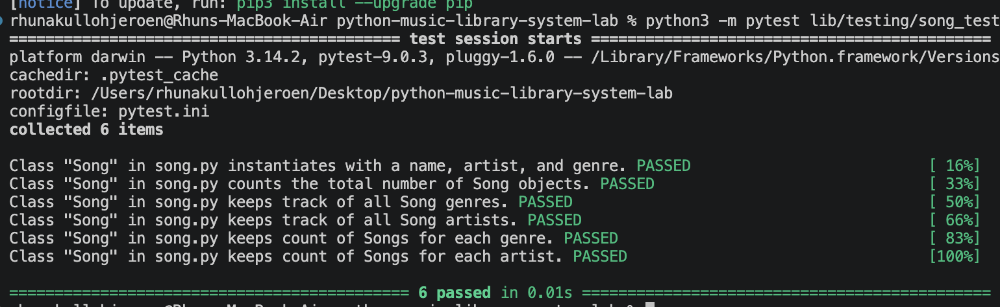

# Music Library System — OOP Lab

A Python class that models a music library. The `Song` class tracks individual songs and maintains global statistics across all songs created.

## Features

- Create song objects with a name, artist, and genre
- Automatically track the total number of songs
- Maintain lists of all unique artists and genres
- Count how many songs belong to each genre
- Count how many songs each artist has

## Song Class

### Instance Attributes

| Attribute | Description |
|-----------|-------------|
| `name` | Title of the song |
| `artist` | Artist who performs the song |
| `genre` | Genre the song belongs to |

### Class Attributes

| Attribute | Description |
|-----------|-------------|
| `count` | Total number of Song objects created |
| `genres` | List of all unique genres |
| `artists` | List of all unique artists |
| `genre_count` | Dict mapping each genre to its song count (e.g. `{"Rap": 5, "Rock": 1}`) |
| `artist_count` | Dict mapping each artist to their song count (e.g. `{"Beyonce": 17, "Jay-Z": 40}`) |

### Class Methods

| Method | Description |
|--------|-------------|
| `add_song_to_count` | Increments `count` by 1 |
| `add_to_genres` | Appends genre to `genres` if not already present |
| `add_to_artists` | Appends artist to `artists` if not already present |
| `add_to_genre_count` | Increments the genre's count in `genre_count`, or sets it to 1 |
| `add_to_artists_count` | Increments the artist's count in `artist_count`, or sets it to 1 |

All five methods are called automatically each time a new `Song` is instantiated.

## Usage

```python
from song import Song

Song("99 Problems", "Jay Z", "Rap")
Song("Halo", "Beyonce", "Pop")
Song("Smells Like Teen Spirit", "Nirvana", "Rock")
Song("Lemonade", "Beyonce", "Pop")

print(Song.count)               # 4
print(Song.genres)              # ['Rap', 'Pop', 'Rock']
print(Song.artists)             # ['Jay Z', 'Beyonce', 'Nirvana']
print(Song.genre_count)         # {'Rap': 1, 'Pop': 2, 'Rock': 1}
print(Song.artist_count)        # {'Jay Z': 1, 'Beyonce': 2, 'Nirvana': 1}
```

## Test Results

<!-- Add a screenshot of your passing test output here -->


## Setup

```bash
pipenv install
pipenv shell
python -m pytest lib/testing/song_test.py -v
```

## Tools & Resources

- [Python Documentation](https://docs.python.org/3/)
- [Python Class Attributes Guide — Toptal](https://www.toptal.com/python/python-class-attributes-an-overly-thorough-guide)
- [Instance, Class, and Static Methods — Real Python](https://realpython.com/instance-class-and-static-methods-demystified/)
